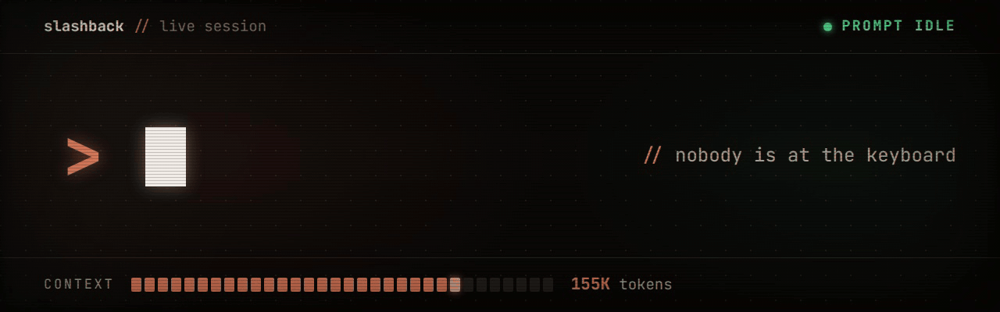

<p align="center"></p>

# slashback

slashback lets a running Claude Code session execute `/compact`, or another allowlisted slash command, against itself, exactly as if a human had typed it at the prompt. It works in a session reached over plain SSH and in a session launched by T3 Code. The SSH path was worked out and verified on 2026-09-09 against Claude Code 2.1.263–2.1.267 running under a bare SSH login, with no tmux or screen in between, on Linux 7.0.0-30-generic, and the T3 path on 2026-09-27.

On the SSH path, the short version is that the only thing the TUI treats as a real command is a keystroke arriving on its terminal input, so the whole problem reduces to getting characters onto that input from inside a tool call. Every channel that looks like it should carry a command turns out not to, and the one channel that does, the pty master, belongs to `sshd` and is fenced off from the obvious `/proc` route. The unlock is to duplicate the master file descriptor out of `sshd` with `pidfd_getfd`, and the sections below explain both why the easy doors are locked and why this one opens.

## The one-line answer

From inside the session, arm the injector detached, handing it this session's own pid and session id from the environment Claude Code exports to every tool shell, then end the turn immediately and say nothing else:

```bash
LOG="${CLAUDE_CONFIG_DIR:-$HOME/.claude}/slashback.log"
setsid python3 slashback.py \
  --pid "$CLAUDE_PID" --session "$CLAUDE_CODE_SESSION_ID" --log "$LOG" >/dev/null 2>&1 &
disown
```

A second or two after the turn ends and the prompt goes idle, `/compact` appears on the input line and submits itself, and the TUI parses and runs it the same way it would for a human. The command defaults to `/compact`; pass a different one with `--command`. `--dry-run` runs every step except the keystrokes and is the way to test an installation. The injector re-executes itself under `sudo -n` for this path, so the wrapper does not need `sudo`. When the session was launched by T3 Code instead of a terminal, the same command takes a different route, which is described in [its own section](#under-t3-code-the-hosts-own-api-is-the-input).

## Prerequisites

Passwordless `sudo` is the main one for the SSH path, because duplicating the descriptor needs `PTRACE_MODE_ATTACH` permission on the `sshd` process. The injector holds root only long enough to take the descriptor and then drops back to the invoking user before it touches the transcript, the lock file, or the log. Beyond that it needs Linux 5.6 or newer for `pidfd_getfd`, glibc for the raw syscall, `python3`, and a session that really is reached over SSH so that an `sshd` ancestor holds the master. Kernels that lock `pidfd_getfd` down further through an LSM policy would need that policy relaxed.

## Why the obvious approaches do not work

### The SendMessage tool refuses to address the session itself

Claude Code's peer-messaging tool carries an explicit self-target guard. It rejects the session's own name, its `[ref]` form, and the alias `main`, so all three ways of naming yourself are covered. There is no tool-level path to your own inbox.

### The peer socket delivers messages but never parses them as commands

Each session registers a Unix domain socket and a `peerToken`, and it is entirely possible to speak the NDJSON wire protocol to your own inbox directly and have the message appear in the conversation. That part works. What does not work is getting a command out of it: slash-command parsing lives in the TUI's input component and runs only on typed input, so a `/compact` delivered over the socket arrives as literal text wrapped in the usual peer-message envelope. The message is real, the command is not.

### The control-frame channel has no compact action

The same socket accepts control frames rather than user messages, but the action whitelist has exactly three entries: `rename`, which routes to the rename handler, `peer_message_status`, and `notify_when_idle`. There is nothing in that list that triggers compaction, and unknown actions are dropped.

### Auto-compaction is a different thing wearing the same name

You can absolutely cause a compaction to happen by editing `~/.claude/settings.json`, since `autoCompactEnabled` plus a small `autoCompactWindow` will arm the threshold check that runs at the start of each turn, and the config file is watched with inotify so the change takes effect without a restart. The arm fraction comes from a Statsig gate and sits around 0.92 of the window by default, and there is a `CLAUDE_AUTOCOMPACT_PCT_OVERRIDE` environment variable, though that one is only read at process start.

This is worth knowing about and it is worth not using. Auto-compaction is the harness deciding to compact on its own schedule, which is a genuinely different event from the user running the command, and if the goal is the latter then the settings route is a way of appearing to succeed without succeeding. It also mutates global config as a side effect, which then has to be reverted.

### The kernel closes the ordinary injection tricks for an unprivileged process

The classic trick for shoving characters into your own terminal is the `TIOCSTI` ioctl, and for an ordinary user it is disabled here:

```
dev.tty.legacy_tiocsti = 0
```

That sysctl has an exception: a process with `CAP_SYS_ADMIN` may still use `TIOCSTI`, and a quick test on a scratch pty confirmed that under `sudo` the ioctl succeeds on this kernel and the byte lands in the slave's input queue. So once passwordless `sudo` is on the table, opening `/dev/pts/N` as root and calling `TIOCSTI` is a second viable route that does not even need an `sshd` ancestor. This writeup and the shipped injector use the master-descriptor route described below, which writes to the same file `sshd` writes to and so behaves identically to real network input, but the `TIOCSTI` route is the simpler one if the SSH constraint ever becomes a problem.

Attaching a debugger to the parent and driving it from there fails for a related reason:

```
kernel.yama.ptrace_scope = 1
```

which permits tracing descendants only, and the claude process is an ancestor rather than a descendant of anything spawned from inside a tool call.

## The unlock: duplicating the pty master out of `sshd`

The one descriptor that is genuinely wired to the TUI's input is the pty master. When the session is reached over SSH that master belongs to `sshd`, and the tempting move is to reopen it through `/proc/<sshd-pid>/fd/<n>`. That does not work: `sshd` marks itself non-dumpable, so the same user cannot open anything out of its `/proc/<pid>/fd`, and even where such a path is openable, opening a pty master by name hands back a freshly allocated pty rather than the existing open file, so the characters go nowhere the TUI is listening.

`pidfd_getfd` sidesteps both problems. It duplicates the actual open file description out of another process's descriptor table, so what comes back is the real master that `sshd` is already holding, not a new pty and not a `/proc` reopen. The call needs `PTRACE_MODE_ATTACH` permission on the target, which is exactly what running under `sudo` supplies. Because it is the same open file description, the duplicate shares `sshd`'s file status flags, including non-blocking mode, which is why the injector treats every write as potentially short and retries with a bounded wait rather than assuming a single `write` delivered the whole command.

The injector puts this together without any hardcoded process ids. It is handed the claude pid and session id at arm time, verifies that the pid really is a `claude` process owned by the invoking user, reads the controlling pts number from the process's standard descriptors, walks up the ancestry to find the `sshd` processes, and for each of their descriptors calls `pidfd_getfd` and then `TIOCGPTN` to ask which pts that master controls. The descriptor whose pts number matches the session's is the right one, and writing `/compact\r` to it lands on the input line. Permission errors from `pidfd_getfd` abort with a message rather than being mistaken for "no matching descriptor".

## Why it must be detached and idle-gated

Two separate timing failures will silently swallow the command, and both look identical from the outside because the input line simply ends up empty.

The first is that keystrokes arriving while claude is busy executing a tool call are queued rather than executed. If the write runs synchronously inside the Bash tool call that arms it, the session is by definition busy at that moment, so the text sits in the queue and does nothing useful. Detaching with `setsid` and waiting past the end of the turn is what puts the keystrokes at an idle prompt, and `disown` keeps the shell from tracking the job so the tool call returns immediately rather than blocking on it.

The injector waits for that idle prompt rather than guessing at a fixed delay, and it reads the prompt's state from the session's own transcript rather than inferring it from CPU load. Claude Code appends each turn to a jsonl transcript under `<config>/projects/<project>/<session-id>.jsonl`, where `<config>` is `~/.claude` unless `CLAUDE_CONFIG_DIR` overrides it and `<project>` is the working directory with every non-alphanumeric character replaced by a dash, unless `CLAUDE_CODE_PROJECT_DIR_NAME` names it explicitly. The injector reads both overrides out of the claude process's own environment and opens that exact file. It does not pick the newest file in the directory, because subagent transcripts and sibling sessions in the same directory live there too and either would make it gate on the wrong conversation.

A turn that has handed control back to the user ends with an assistant message whose `stop_reason` is `end_turn` (or `refusal`), followed only by bookkeeping entries such as the stop-hook summary, turn duration, and cost snapshots; a turn still in flight ends in a tool-use or tool-result entry instead. The injector watches the tail of the file and fires only once the newest state-bearing entry is such a finished turn and the file has then stayed quiet for about a second. This is what distinguishes a genuinely idle prompt from a turn that merely looks quiet because it is blocked on network I/O: a blocked turn has not written its `end_turn` yet. Everything the injector does not positively recognise counts as busy. A trailing partial line is an append in progress, an entry type it has never seen may be new state, and a `max_tokens` stop describes the model rather than the TUI, so all of them block injection rather than permit it. There is no CPU-idle fallback: if the transcript cannot be found or read, nothing is typed.

Two further checks guard the terminal itself. The injector holds a pidfd on the claude process and confirms it is still alive, and it reads `/proc/<pid>/stat` to confirm that claude's process group is the foreground group on its tty, so if claude has exited or been suspended and the pty has gone back to the login shell, the keystrokes are not sent there. All of these checks are repeated immediately before each of the three writes (Ctrl-U to clear the line, the command, and Enter), so a prompt that stops being idle mid-sequence receives at most a cleared line and never a submitted command. A per-session lock file prevents two injectors from interleaving their keystrokes. It fires exactly once and then exits, giving up after ninety seconds if no idle window opens. The single-shot design matters: an injector that retried would queue several `/compact` invocations behind a busy prompt and spray them the moment it went idle.

The one thing the transcript cannot tell the injector is whether a human has typed an unsubmitted draft into the input line. Ctrl-U clears it, which is the right behaviour for a session driving itself and the wrong behaviour for a session someone else is typing into, so the skill is only for the former.

## Verifying that it actually fired

The failure mode here is believing it worked when the write was swallowed, so the injector records what it did. The log names the transcript it gated on and then one of `delivered`, `aborted before <step>: <reason>`, or `gave up: <reason>`, and after delivering `/compact` it watches the transcript for up to a minute and logs `compaction observed in transcript` when a `compact_boundary` entry appears. Compaction also writes a message with `isCompactSummary: true`, so counting those in the transcript before and after is an independent check. A `delivered` line without an observed compaction means the keystrokes reached the terminal but the TUI did not compact, for instance because the conversation was too short; a `gave up` line names the check that never passed. A `setup error` line means the injector stopped before arming, for example because the pid was not a claude process or no sshd held the master. The exit status is 0 when delivered, 2 when it gave up or aborted, and 1 on a setup error.

## Under T3 Code, the host's own API is the input

A session run inside T3 Code has no terminal at all. T3 launches claude as an Agent SDK child (`--input-format stream-json`) whose standard streams are sockets back to the T3 server, so there is no pty master to duplicate and no sshd ancestor, and a dry run of the SSH path stops at `controlling pts not found`. Writing into claude's input socket directly would be possible with enough privilege, but it would start a turn T3 did not ask for and would leave T3's view of the thread out of step with what the provider is doing, so that route is deliberately not taken.

T3 already offers a supported way in. Its server exposes an authenticated HTTP API that the `t3` CLI itself uses to drive a running server: `GET /api/orchestration/threads/<id>` returns a thread snapshot, and `POST /api/orchestration/dispatch` accepts the same `thread.turn.start` command the composer sends when the user presses Enter. T3's server also special-cases a message whose text is exactly `/compact`. It runs a compaction through the provider instead of an ordinary turn, refuses with "Context compaction is unavailable while a provider turn is running" if the thread is busy, and records the result as a `context-compaction` activity (or a `provider.turn.start.failed` activity on failure) tagged with the message id. That makes the T3 path both the safest and the most observable of the routes, because the host is fully aware of the compaction and reports its outcome itself.

The injector finds the T3 server by walking claude's ancestors and accepting one only when its data directory's `server-runtime.json` names that exact pid. It maps the session id to a T3 thread with a read-only lookup in T3's `provider_session_runtime` table and mints a bearer session with `t3 auth session issue`, whose time-to-live covers the whole run, in the same way `t3 project add` authenticates to a running server. The token is held only in memory, is sent only to a loopback origin with proxies disabled, and is revoked with `t3 auth session revoke` when the injector exits. It then waits until the thread's provider session is `ready` with no active turn and its newest message is a finished assistant reply, stable across two polls. At that point it dispatches `/compact` and watches the snapshot for the outcome activity carrying its message id.

Compaction ends the model's turn and nothing else will start the next one, so on this path the injector finishes with a single fixed follow-up message, `[slashback] Context compacted. Continue where you left off.`, once the thread has gone idle again. If compaction failed, the follow-up carries the failure reason instead, so the session still resumes and knows what happened. `--no-resume` turns the follow-up off. The follow-up text is fixed rather than configurable on purpose, because a free-form self-message would let the session put arbitrary words in the user's mouth. No step of this path needs root, and the injector drops privileges first if it was started under `sudo`.

This path was verified end to end on 2026-09-27 against a T3 server at 0.0.43-nightly.20260926.2282 running Claude Code 2.1.283. A session armed the injector against itself and ended its turn. About ten seconds later the injector dispatched `/compact`, and T3 recorded a `context-compaction` activity carrying the injector's message id that took the context from 155K to 5.02K tokens. The fixed follow-up then started the next turn, which picked the work back up from the summary, and `t3 auth session list` showed that the injector's bearer session had been revoked.

## Generalising beyond `/compact`

Nothing in the SSH mechanism is specific to compaction. Any slash command the TUI accepts could be driven the same way, since the only thing being exploited is that a duplicated master fd can put real characters on the input line. That is exactly why the injector does not accept any slash command. The session chooses the command itself, possibly after reading text it should not trust, and the keystrokes carry the user's full authority, so a session that could type `/permissions`, `/hooks` or `/login` could hand itself anything.

The injector therefore checks the command against an allowlist rather than a denylist. Claude Code 2.1.283 ships about 105 built-in commands and adds more with most releases, many of them have aliases (`/clear` is also `/reset` and `/new`), and every skill, plugin command and MCP prompt is a slash command as well, so a denylist would fail open. The allowlist is deliberately lenient about anything whose worst case is cosmetic or undone by one more command. It admits context upkeep (`/compact`, `/recap`, `/context`, `/reload-skills`, `/pause-memory`, `/rename`, `/btw`, `/list-agents`), read-only information (`/usage`, `/status`, `/version`, `/help`, `/skills`, `/skill-doctor`, `/doctor`, `/release-notes`, `/diff`), display and mode (`/plan`, `/brief`, `/focus`, `/theme`, `/color`, `/tui`, `/scroll-speed`), and `/model` and `/effort` restricted to known aliases and levels. It still refuses everything that loosens the permission boundary or saved configuration, touches accounts or billing, sends the conversation off the machine, discards or forks the session, lets the model set its own stopping condition (`/goal`), or runs a skill. Each allowed command also has an argument pattern. Free text never contains `@`, which opens the file picker and would swallow the Enter, or `\`, which turns the Enter into a newline, and aliases are not accepted at all.

The other constraints carry over unchanged: the session is reached over SSH, passwordless `sudo` is available, the keystrokes land while the prompt is idle, and only one command is ever sent. The T3 path is narrower by design and accepts only the exact message `/compact`. Other slash commands would reach the provider as ordinary turn text, and some, such as `/logout`, are intercepted by T3 itself with side effects the injector should not be able to trigger.

## Installing it as a skill

The same mechanism ships as a Claude Code skill so a session can invoke it on demand. `SKILL.md` and `slashback.py` in this repo are the skill; place or symlink the directory at `~/.claude/skills/slashback/` and the session can run the arming step above against itself. `python3 test_slashback.py` (or `pytest`) runs the unit tests, which cover the transcript gate, the path resolution, the guards, the write loop, and the T3 idle gate, outcome matching, and API client without needing sudo, T3, or a live session.
